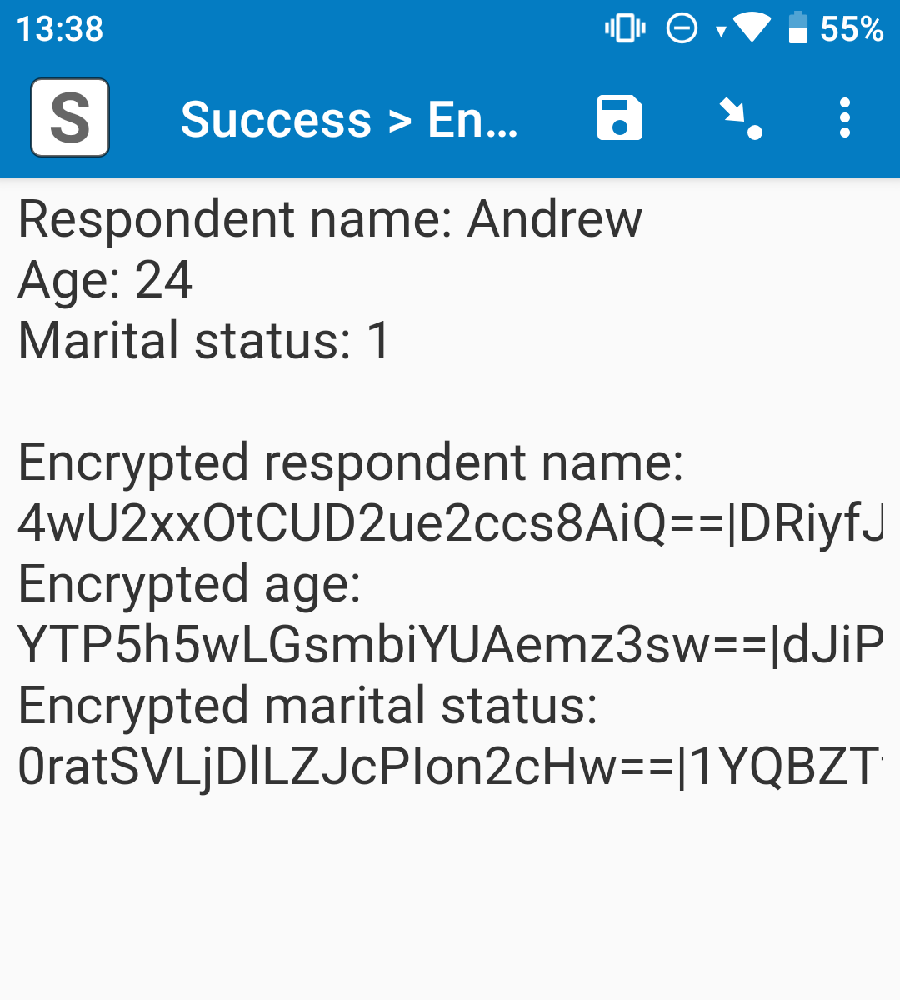

# Encrypt (field plug-in)



## Description

This field plug-in encrypts data inside forms using [AES](https://en.wikipedia.org/wiki/Advanced_Encryption_Standard). Provide an encryption key and input, and the plug-in will encrypt the input. This field plug-in was designed for use along with the [decrypt field plug-in](https://github.com/surveycto/decrypt) and the [scto-encryption package](https://github.com/surveycto/scto-encryption).

Together with these other resources, the encrypt plug-in provides an upgrade in secure management of sensitive data that is used to identify individuals in the field. Learn more in [this guide](https://support.surveycto.com/hc/en-us/articles/33842170036499).

The gold standard for added security is still [form data encryption](https://support.surveycto.com/hc/en-us/articles/16472121582483). Use form data encryption to protect any data that is not being directly published to the server dataset.

*This plug-in is currently under beta. If you find a problem with the field plug-in, please email plug-in-feedback@surveycto.com.*

[](https://github.com/surveycto/encrypt/raw/main/encrypt.fieldplugin.zip)

### Features

* Encrypt one or more pieces of data using a single instance of the field plug-in.

**Note**: This field plug-in currently only supports AES-CBC decryption.

### Requirements

This field plug-in should work on most collection devices that support field plug-ins. Ensure that you test on all variants of target devices before use.

Use this field plug-in on a [*text* field](https://docs.surveycto.com/02-designing-forms/01-core-concepts/03a.field-types-text.html).

### Data format

#### Encrypted data format

Each encrypted data entry will combine the ciphertext and initialization vector (IV), separated by a pipe (`|`). 

Here is an example:

```
f5l2KcvRKodlSf6n06tqgQ==|XSFHs2RWb/w2bo5VC2+ipg==
```

Here, the ciphertext is `f5l2KcvRKodlSf6n06tqgQ==`, and the IV is `XSFHs2RWb/w2bo5VC2+ipg==`.

The ciphertext and IV are both encoded using Base64.

#### Field value

This field returns the encrypted data in a list. The default list separator is a space, but you can customize it. The order of the encrypted data will be the same as the order of the plaintext data provided to the [parameters](#parameters).

For example, let's say the first piece of encrypted data has a value of `f5l2KcvRKodlSf6n06tqgQ==|XSFHs2RWb/w2bo5VC2+ipg==` and the second has a value of `imE9GbCxHJJAq3BVXmGpgg==|dqoSP2Jb/jOWPa8eleug/w==`. The field value would be this:

```
f5l2KcvRKodlSf6n06tqgQ==|XSFHs2RWb/w2bo5VC2+ipg== imE9GbCxHJJAq3BVXmGpgg==|dqoSP2Jb/jOWPa8eleug/w==
```

Use the [selected-at() function](https://docs.surveycto.com/02-designing-forms/01-core-concepts/09.expressions.html#Help_Forms_selected-at) to retrieve this data. For example, if the field with the field plug-in has the *name* "encrypt", to retrieve the first piece of data from that list, use this expression in a *calculate* field:

```
selected-at(${encrypt}, 0)
```

If the encryption key is in an incorrect format, the data will instead be an error message about why the data could not be decrypted.

**Note**: The encryption re-occurs every time you go to the field with the field plug-in, and every time encryption occurs, a new, random IV is generated to help encrypt the data. Thus, the encrypted data (ciphertext and IV) will change each time you revisit the field. This is perfectly fine, and you can still use the same encryption key to decrypt your data later.

#### Field display

When you reach the field, it will display your field *label* (and *hint* and media if you include them as well) at the top, followed by the results of the decryption. If the decryption was successful, it will say "Success". However, if decryption failed, it will say "Failed", followed by the reason for the decryption failure. This occurs for each piece of plaintext data received.

#### Metadata

The metadata will be a pipe-separated list of the encryption status, in the same order as the data (similar to what appeared in the field *label*).

For example, if all of the data was encrypted successfully, the metadata will be this:

    Success|Success|Success

However, if the encryption key format is incorrect, the metadata might look like this:

```
Failed: The Base64 encryption key provided is not properly encoded. Please make sure it is properly encoded: RQmHY+vQ5UQOeufZZQHZhg=|Failed: The Base64 encryption key provided is not properly encoded. Please make sure it is properly encoded: RQmHY+vQ5UQOeufZZQHZhg=|Failed: The Base64 encryption key provided is not properly encoded. Please make sure it is properly encoded: RQmHY+vQ5UQOeufZZQHZhg=
```

(All three of the error messages are the same, since all errors are caused by the same issue.)

Use the [plug-in-metadata() function](https://docs.surveycto.com/02-designing-forms/01-core-concepts/09.expressions.html#plug-in-metadata) in your form in a [*calculate* field](https://docs.surveycto.com/02-designing-forms/01-core-concepts/03zb.field-types-calculate.html) to retrieve the metadata.

## How to use

### Getting started

**To use this field plug-in as-is:**

1. Download the [sample form](https://github.com/surveycto/encrypt/raw/main/extras/sample-form/Encryption%20field%20plug-in%20sample%20form.xlsx).
1. Download the [encrypt.fieldplugin.zip](https://github.com/surveycto/encrypt/raw/main/encrypt.fieldplugin.zip) field plug-in file.
1. Upload the sample form to your server with the field plug-in file as an attachment.
1. If you choose to scan the encryption key, scan this QR code:


If you choose *Manual entry*, the *default* field value will include the example encryption key (i.e., no need to type anything). Do not modify the default value.

**Warning**: This is just an example, and you should **not** publicly share your encryption key like this. Nor should you hard-code the encryption key into your form design (this also nullifies the security benefit). You should use your own encryption key to encrypt and decrypt your data.

If you decide to use a QR code to store your encryption key, make sure that QR code is well-protected, since anyone who has access to the QR code and your form (whether on Collect or the server) can decrypt your data.

### Parameters

For named parameters, this field plug-in has one required parameter and one optional parameter.

In addition to the named parameters, add a parameter for each piece of plaintext. The name of the parameter can be anything (as long as they are unique). For example, let's say there are three form fields that store ciphertext: "respondent_name", "age", and "marital". You can give the field this *appearance*:

```
custom-encrypt(key=${key},
0=${respondent_name},
1=${age},
2=${marital})
```

The first parameter is the required parameter, while the second, third, and fourth parameters take the plaintext data. These parameters have the names "0", "1", and "2", but their names don't actually matter (as long as they are unique, e.g. you cannot have two parameters called "0"). You can use use numbers and letters in parameter names (e.g. the parameter name `0` can be `respondent_name` instead, or anything else).

While the parameter names do not matter, the parameter **order** does matter. This field's *value* will be the encrypted values of the fields "respondent_name", "age", and "marital" in the same order as the parameters in a space-separated list.

Here are the named parameters:

|Name|Description|
|---|---|
|`key` (required)| The passkey used to encrypt the data, which is required for decryption. **This key must be Base64-encoded**. See the [scto-encryption package](https://github.com/surveycto/scto-encryption) for guidance on securely generating passkeys. |
|`separator` (optional) | The separator used in the list returned by the field plug-in. You can use any character EXCEPT those used by Base64 encoding (uppercase and lowercase letters, numbers, slash `/`, and plus `+`) and a pipe `\|` (which is used as the ciphertext-IV separator).The default is a space character (`(space)`). |

### Default SurveyCTO feature support

| Feature / Property | Support |
| --- | --- |
| Supported field type(s) | `text`|
| Default values | No |
| Constraint message | Uses default behavior |
| Required message | Uses default behavior |
| Read only | No |
| media:image | Yes |
| media:audio | Yes |
| media:video | Yes |
| `numbers` appearance | No |
| `numbers_decimal` appearance | No |
| `numbers_phone` appearance | No |

## More resources

* **Sample form**  
You can find a form definition in this repo here: [extras/sample-form](extras/sample-form).

* **Developer documentation**  
   * Python users can also check out our [`surveycto-encryption` package](https://github.com/surveycto/surveycto-encryption/blob/main/README.md) to help encrypt and decrypt data.
   * More instructions for developing and using field plug-ins can be found here: [https://github.com/surveycto/Field-plug-in-resources](https://github.com/surveycto/Field-plug-in-resources)
   * This field plug-in was developed using SubtleCrypto, which you can learn more about [here](https://developer.mozilla.org/en-US/docs/Web/API/SubtleCrypto).
