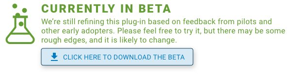

# Encrypt (field plug-in)

## Description

Use this field plug-in to encrypt data using AES.

Currently, the best way to protect SurveyCTO form data is using our end-to-end encryption feature, which you can learn about in our support article [How to encrypt a form](https://support.surveycto.com/hc/en-us/articles/16472121582483). And, the best way to protect all SurveyCTO data (including server dataset data) is to use existing SurveyCTO security features, which you can read about [here](https://github.com/surveycto/decrypt/blob/main/extras/best_encryption.md).

However, if you would like an extra level of security, you can also encrypt your form data using your own AES encryption key. This data can even be published to a [server dataset](https://support.surveycto.com/hc/en-us/articles/11854064982675) for [pre-loading](https://docs.surveycto.com/02-designing-forms/03-advanced-topics/03.preloading.html), and then decrypted later using the [decrypt](https://github.com/surveycto/decrypt/blob/main/README.md) field plug-in.

[](https://github.com/surveycto/encrypt/raw/main/encrypt.fieldplugin.zip)

*This plug-in is currently under beta. If you you find a problem with the field plug-in, please email support@surveycto.com, or submit an issue to this GitHub repo.*

### Features

* Encrypt using AES, an extremely popular and secure encryption standard.
* Encrypt multiple pieces of data in one field plug-in.

Note: This field plug-in currently only supports AES-CBC decryption. If popular enough, we could add other modes, such as AES-GCM. If you don't know what those are, don't worry, you don't have to know them to use this field plug-in.

### Requirements

This field plug-in should work on most collection devices that support field plug-ins.

Use this field plug-in on a [*text* field](https://docs.surveycto.com/02-designing-forms/01-core-concepts/03a.field-types-text.html).

### Data format

#### Encrypted data format

Each piece of encrypted data will be a concatenation of the ciphertext and the initialization vector (IV), separated by a pipe (`|`). Here is an example:

```
f5l2KcvRKodlSf6n06tqgQ==|XSFHs2RWb/w2bo5VC2+ipg==
```

Here, the ciphertext is `f5l2KcvRKodlSf6n06tqgQ==`, and the IV is `XSFHs2RWb/w2bo5VC2+ipg==`.

The ciphertext and IV are both encoded using Base64.

#### Field value

This field returns the encrypted data in a list. The default separator in the list is a space, but you can customize this. The order of the encrypted data will be the same as the order of the plaintext data provided to the [parameters](#parameters).

For example, let's say the first piece of encrypted data has a value of `f5l2KcvRKodlSf6n06tqgQ==|XSFHs2RWb/w2bo5VC2+ipg==` and the second has a value of `imE9GbCxHJJAq3BVXmGpgg==|dqoSP2Jb/jOWPa8eleug/w==`. The field value would be this:

```
f5l2KcvRKodlSf6n06tqgQ==|XSFHs2RWb/w2bo5VC2+ipg== imE9GbCxHJJAq3BVXmGpgg==|dqoSP2Jb/jOWPa8eleug/w==
```

Use the [selected-at() function](https://docs.surveycto.com/02-designing-forms/01-core-concepts/09.expressions.html#Help_Forms_selected-at) to retrieve this data. For example, if the field with the field plug-in has the *name* "encrypt", to retrieve the first piece of data from that list, use this expression:

```
selected-at(${encrypt}, 0)
```

If the encryption key is in an incorrect format, the data will instead be an error message about why the data could not be decrypted.

Note: The encryption re-occurs every time you go to the field with the field plug-in, and every time encryption occurs, a new, random IV is generated to help encrypt the data. This means the encrypted data (including the ciphertext and IV) will change every time you return to the field. This is perfectly fine, and you can still use the same encryption key to decrypt your data later.

#### Field display

When you reach the field, it will display your field *label* (and *hint* and media if you include them as well) at the top, followed by the results of the decryption. If the decryption was successful, it will say "Success". However, if decryption failed, it will say "Failed", followed by the reason for the decryption failure. It will do this for each piece of plaintext data it receives.

### Parameters

For named parameters, this field plug-in has 1 required parameter and 1 optional parameter.

In addition to the named parameters, add a parameter for each piece of plaintext. The name of the parameter can be anything (as long as they are unique). For example, let's say there are three form fields that store ciphertext: "respondent_name", "age", and "marital". You can give the field this *appearance*:

```
custom-encrypt(key=${key},
0=${respondent_name},
1=${age},
2=${marital})
```

The first parameter is the required parameter, while the second, third, and fourth parameters take the plaintext data. These parameters have the names "0", "1", and "2", but their names don't actually matter (as long as they are unique, e.g. you cannot have two parameters called "0"). This field's *value* will be the encrypted values of the fields "respondent_name", "age", and "marital" in that order in a space-separated list.

Here are the named parameters:

|Name|Description|
|---|---|
|`key` (required)| The passkey that was used to encrypt the data, which will be used to decrypt the data. **This key must be Base64-encoded**. |
|`separator` (optional) | The separator used in the list returned by the field plug-in. This should be a value that does not exist in your decrypted data (but it can exist in the ciphertext).<br>**Default**: (space) |

### Default SurveyCTO feature support

| Feature / Property | Support |
| --- | --- |
| Supported field type(s) | `text`|
| Default values | No |
| Constraint message | Uses default behavior |
| Required message | Uses default behavior |
| Read only | No |
| media:image | Yes |
| media:audio | Yes |
| media:video | Yes |
| `numbers` appearance | No |
| `numbers_decimal` appearance | No |
| `numbers_phone` appearance | No |

## More resources

* **Sample form**  
You can find a form definition in this repo here: [extras/sample-form](extras/sample-form).

* **Developer documentation**  
   * Python users can also check out our [`surveycto-encryption` package](https://github.com/surveycto/surveycto-encryption/blob/main/README.md) to help encrypt and decrypt data.
   * More instructions for developing and using field plug-ins can be found here: [https://github.com/surveycto/Field-plug-in-resources](https://github.com/surveycto/Field-plug-in-resources)
   * This field plug-in was developed using SubtleCrypto, which you can learn more about [here](https://developer.mozilla.org/en-US/docs/Web/API/SubtleCrypto).
